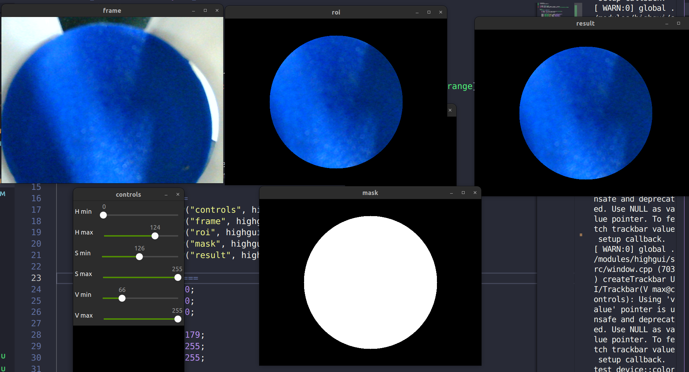
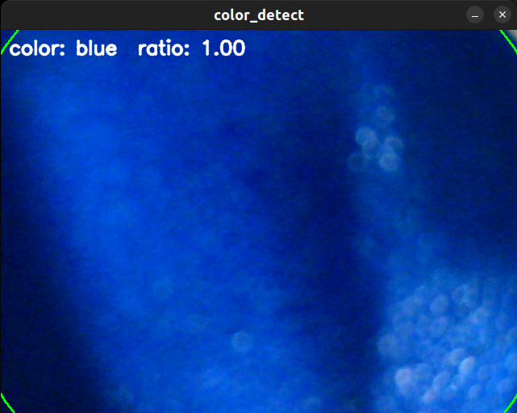

## RoboCup 2026 视觉代码

### 写在前面

#### 为什么不使用py/C++?
* 最主要还是因为不想用py。每次开发py代码，自己都懒得动手，啥都让AI写，写一会儿函数堆成山了，也没感觉，直到最后真是一坨屎了，才开始重构代码
* 使用rust则没有这种烦恼，但凡有一个文件没有`mod`，没有在合理的位置写，编译器会先报错。
* C++的话我只能说我用不明白。CMake足够好用了但我觉得还是一坨。现代语言应该杜绝继承(C++的多继承是不得不品鉴的一个环节哈哈哈)，转向函数式编程。

#### rust优势很大吗？
* 虽然是rust的速度比py快，但这样一个工程，绝大多数性能都在调用`OpenCV`上，无论是py还是rust，速度几乎没区别。快不是选择rust的理由
* `Cargo`如果你是一个对配环境极其讨厌的人，我特别推荐你使用rust。`Cargo`包管理器是一个十分优雅的东西，实在是太强了，太好用了。比pip还好用
* 你敢信你拿到我这个项目只需要`自己安装OpenCV`，然后`cargo run`，Cargo会自动帮你下载所有依赖,如此简单为何不用。

#### rust有没有什么劣势
* rust学习路线陡峭，非常陡峭，异常陡峭
* 除此之外没有任何劣势

### 项目简介
(这里主要是吹nb，如果想看具体功能实现建议直接跳转到下面)
- [功能概述](#功能概述)
#### 项目展望
  既然使用了rust，那么我当然希望这个项目拥有足够的泛用性。当然，目前的组织逻辑也是如此。
* `配置类`：现在的配置都使用了`config.toml`进行配置，减少硬编码
* `摄像头注册`：`动态代理`，一个十分实用的设计模式。我们通过`摄像头注册`模块快速进行摄像头的配置，调用，唤醒，重连。掌管所有`camera`的整个生命周期的使用权，可以任由各种函数作为资源使用
  * 目前重连和唤醒还未实现
  * 终极幻想，摄像头可以同时使用多个不同功能，这也是动态代理的精髓。可能在`车型`的作用不大，但是一定会有适用场景。 比如我们扫描完颜色之后的摄像头，是否可以让这个摄像头直接去扫描`十字轮廓`呢?
* `GPIO引导的任务驱动模式`: 无论是颜色识别，还是二维码识别，我们一直让程序`loop`或者`wait`终究不是个好的解决办法，我们通过额外开一个`GPIO thread`来接受`task`,需要我们的时候，由电控来调用。
  * 这样视觉就成了一个`可插拔的模块`。由电控来决定什么时候使用`资源`。

#### 最终幻想
这个项目最终应该是一个`成熟的可移植的`项目，具有良好的通用性，也不知道作者能不能抗住。加油吧，为了减少后生的工作量！！！
### 功能概述
#### 颜色识别
其实，如果是对于一般的颜色识别，对于`如何排除环境干扰`是极其复杂的。

但是，对于我们比赛来说，这是一个极其简单的东西。我们的摄像头可以放在夹爪上面，这样我们需要检测的区域就是固定的了。所以我使用了ROI

此项目主要使用了`ROI`,`HSV筛选`,`面积筛选`
* 获取原始帧frame
* 使用ROI，只关注中间一个圆形区域，其他地方mask掩盖
* HSV筛选，得到mask
* 面积筛选，面积最大而且大于一定值(如0.85)才是我们想要的颜色

#### 二维码识别
先不说太多，因为二维码识别就是调用而已

#### GPIO
这里主要是和电控联调，后期可能有许多通用函数